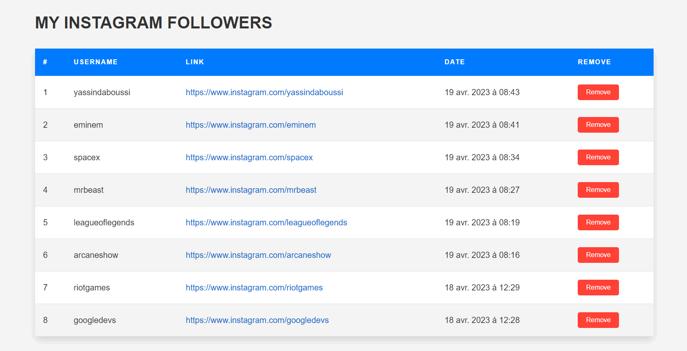
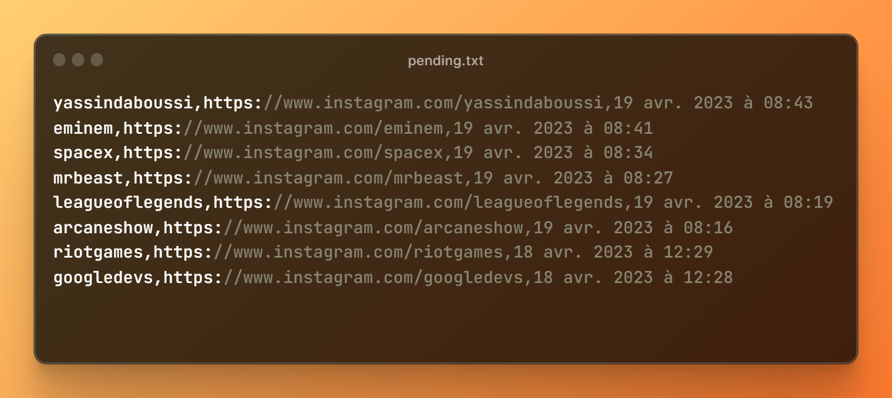

<h2 align="center" >Get Instagram Pending Follow Requests and Render into Custom HTML</h2>

1. Login to Instagram and download your data by following the instructions in the link below. 
   - Select JSON as the format, and the data will be sent to your email by Instagram.
   
2. Download and open the folder emailed by Instagram.
   
3. Navigate to the "followers_and_following" folder and find the file "pending_follow_requests".
   
4. Create a new folder on your computer and copy the "pending_follow_requests" file into it.
   
5. Select the type of extract you want and copy the "ExtractAndRender.py" and "template.html" files into the new folder.
   
6. Run the `ExtractAndRender.py` file to extract the pending follow requests and render them into the custom HTML format.

<h1 align="center"> Screenshot </h1>
 

    
     
    <em>Figure 1: Output Pending.html </em>

    
     
    <em>Figure 2: Output Pending.txt </em>

<h2>🌟Star this repository🌟</h2>

Please ⭐️ this repo and share it with others

(<a href="#top">back to top</a>)

